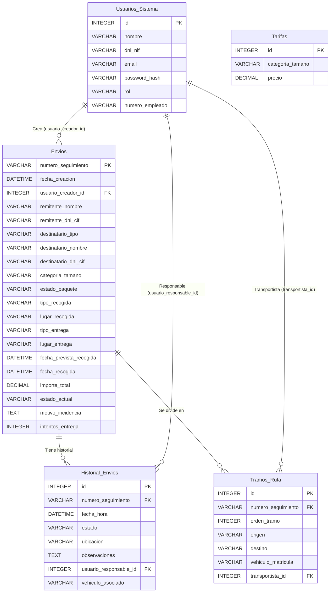

# Memoria proyecto

## Sprint Backlog

| Código | Título Historia                                                            | Descripción                                                                                                                                                                          | Criterios de aceptación                                                                                                                                                                                                                                                                                                                                                                           | Estimación |
| ------ | -------------------------------------------------------------------------- | ------------------------------------------------------------------------------------------------------------------------------------------------------------------------------------ | ------------------------------------------------------------------------------------------------------------------------------------------------------------------------------------------------------------------------------------------------------------------------------------------------------------------------------------------------------------------------------------------------- | ---------- |
| HU-02  | Recogida de información desde la web                                       | Como usuario registrado, quiero poder introducir la información de un envío desde la web para solicitar su gestión y conocer previamente el coste asociado al servicio.              | <ul><li>Usuario accede a "Iniciar proceso de envío".</li><li>Rellena formulario (Destinatario, Paquete por Categoría de tamaño, Datos de Recogida y Entrega).</li><li>El sistema calcula el importe total y muestra un resumen.</li><li>El usuario acepta el importe.</li><li>El sistema genera número de seguimiento, pasa a estado "Envío solicitado" y muestra justificante.</li></ul>         | 5 días     |
| HU-03  | Recogida de información desde servicio web                                 | Como empresa externa, quiero poder enviar la información de un envío mediante una API para gestionar envíos desde mis propios sistemas.                                              | <ul><li>Se recibe petición API con JSON.</li><li>El JSON contiene: Datos empresa, Destinatario, Paquete (Categoría de tamaño) y Envío.</li><li>El sistema valida campos obligatorios y reglas de negocio.</li><li>Si es válido, registra el envío en estado "Envío solicitado" y retorna nº de seguimiento e importe.</li><li>Si es inválido, devuelve los errores correspondientes.</li></ul>    | 5 días     |
| HU-04  | Transportista accede a la información del envío en la recogida del paquete | Como transportista, quiero consultar las recogidas que tengo asignadas desde mi terminal portátil para poder realizar la recogida de los paquetes.                                   | <ul><li>El transportista accede a "Recogidas asignadas".</li><li>Ve la lista de envíos pendientes.</li><li>Al seleccionar uno, ve el detalle: Remitente, Destinatario, Paquete y Envío.</li><li>Al pulsar "Confirmar recogida", el estado del envío cambia a "Recogido".</li><li>Se añade la acción al historial del envío con fecha y hora.</li></ul>                                            | 3 días     |
| HU-06  | Operario de almacén gestiona la llegada de paquete al punto intermedio     | Como operario de almacén, quiero registrar la llegada de un paquete a una instalación logística para verificar su estado y actualizar su ubicación dentro del proceso de transporte. | <ul><li>El operario busca el envío por número de seguimiento.</li><li>El sistema muestra datos básicos y ubicación actual.</li><li>El operario informa del "Estado del paquete" (Correcto, Dañado, etc.).</li><li>Si el estado no es correcto, pasa a "Incidencia detectada" y notifica.</li><li>Si es correcto, al "Confirmar llegada" se registra la nueva ubicación en el historial.</li></ul> | 5 días     |
| HU-07  | Operario de almacen gestiona la salida de paquete del punto intermedio     | Como operario de almacén, quiero gestionar la salida de un paquete desde la instalación logística actual para que continúe su ruta de transporte hacia su próximo destino.           | <ul><li>El operario selecciona el almacén actual.</li><li>Ve tabla de envíos disponibles para salida.</li><li>Al seleccionar, ve detalle del próximo tramo y vehículo asignado.</li><li>Se valida que no haya incidencias y que exista vehículo.</li><li>Al "Confirmar Salida", el envío pasa a "En tránsito" y actualiza historial.</li></ul>                                                    | 3 días     |
| HU-08  | Usuario consulta el estado de su envío                                     | Como usuario, quiero consultar el estado de mis envíos para conocer su situación actual y el historial completo de movimientos realizados.                                           | <ul><li>El usuario accede a "Consultar envíos".</li><li>Ve listado de sus envíos con datos básicos.</li><li>Al seleccionar "Consultar", ve el detalle del envío (remitente, destinatario, paquete, envío).</li><li>Ve un historial cronológico detallado con cada movimiento (fecha, hora, ubicación, estado, responsable).</li></ul>                                                             | 3 días     |

## Product Backlog

| Título Historia                                           | Descripción                                                                                                                                                                  |
| --------------------------------------------------------- | ---------------------------------------------------------------------------------------------------------------------------------------------------------------------------- |
| HU-01: Recogida de información vía telefónica             | Como teleoperador, quiero poder recoger la información del envío vía telefónica para poder gestionar los envíos de los clientes.                                             |
| HU-05: Gerente asigna rutas y vehículos a los envíos      | Como gerente, quiero poder asignar rutas y vehículos a los envíos en estado "En almacén/oficina" para los desplazamientos relativos a la recogida y entrega de los paquetes. |
| HU-09: Usuario cambia el punto de recogida del paquete    | Como usuario, quiero poder cambiar el punto de recogida del paquete para adaptarlo a mis necesidades.                                                                        |
| HU-10: Usuario cambia la dirección de entrega del paquete | Como usuario, quiero poder cambiar la dirección de entrega del paquete para adaptarlo a mis necesidades.                                                                     |
| HU-11: Confirmación de la entrega del envío               | Como transportista u operario, quiero poder confirmar la entrega del envío para indicar que se ha recibido correctamente.                                                    |
| HU-12: Tarificación de los envíos                         | Como gerente, quiero poder establecer una tarifa base para los envíos y poder añadir cargos adicionales según el tamaño del paquete.                                         |

## Modelo de Datos

## Story Mapping

```mermaid
flowchart LR
    classDef pers fill:#e6e6e6,stroke:#cccccc,color:#000,stroke-width:1px;
    classDef goal fill:#0055aa,stroke:#003388,color:#fff,stroke-width:1px;
    classDef act fill:#00aaee,stroke:#0088cc,color:#fff,stroke-width:1px;
    classDef featPend fill:#11aa44,stroke:#008822,color:#fff,stroke-width:1px;
    classDef featDev fill:#ee2222,stroke:#bb0000,color:#fff,stroke-width:3px;
    
    subgraph Col0 [" "]
        direction TB
        L1["(1) Persona / Actor"]:::pers --- L2["(2) Goal"]:::goal --- L3["(3) Activity"]:::act --- L4["(4) Feature (Pendientes)"]:::featPend --- L5["(4) Feature (Desarrolladas)"]:::featDev
    end

    subgraph Col1 [" "]
        direction TB
        P1[Usuario]:::pers --- G1[Contratar Envío]:::goal --- A1[Solicitar Web]:::act --- F1[HU-02: Web]:::featDev
    end

    subgraph Col2 [" "]
        direction TB
        P2[Empresa]:::pers --- G2[Contratar Envío]:::goal --- A2[Solicitar API]:::act --- F2[HU-03: API]:::featDev
    end

    subgraph Col3 [" "]
        direction TB
        P3[Teleoperador]:::pers --- G3[Contratar Envío]:::goal --- A3[Atención Teléfono]:::act --- F3[HU-01: Telefónica]:::featPend
    end

    subgraph Col4 [" "]
        direction TB
        P4[Gerente]:::pers --- G4[Configurar Sistema]:::goal --- A4[Gestionar Tarifas]:::act --- F4_1[HU-12: Tarificación]:::featPend --- F4_2[HU-05: Asignar Rutas]:::featPend
    end

    subgraph Col5 [" "]
        direction TB
        P5[Transportista]:::pers --- G5[Logística y Recogida]:::goal --- A5[Recogida Origen]:::act --- F5[HU-04: Recoger]:::featDev
    end

    subgraph Col6 [" "]
        direction TB
        P6[Operario]:::pers --- G6[Gestión de Almacén]:::goal --- A6[Procesar Paquete]:::act --- F6_1[HU-06: Llegada]:::featDev --- F6_2[HU-07: Salida]:::featDev
    end

    subgraph Col7 [" "]
        direction TB
        P7[Transportista]:::pers --- G7[Logística y Entrega]:::goal --- A7[Entrega Final]:::act --- F7[HU-11: Confirmar Entrega]:::featPend
    end

    subgraph Col8 [" "]
        direction TB
        P8[Usuario]:::pers --- G8[Soporte al Cliente]:::goal --- A8[Modificar Datos]:::act --- F8_1[HU-09: Cambiar Recogida]:::featPend --- F8_2[HU-10: Cambiar Entrega]:::featPend
    end

    subgraph Col9 [" "]
        direction TB
        P9[Usuario]:::pers --- G9[Seguimiento]:::goal --- A9[Visualizar Estado]:::act --- F9[HU-08: Consultar Estado]:::featDev
    end

    Col0 ~~~ Col1 ~~~ Col2 ~~~ Col3 ~~~ Col4 ~~~ Col5 ~~~ Col6 ~~~ Col7 ~~~ Col8 ~~~ Col9
```

